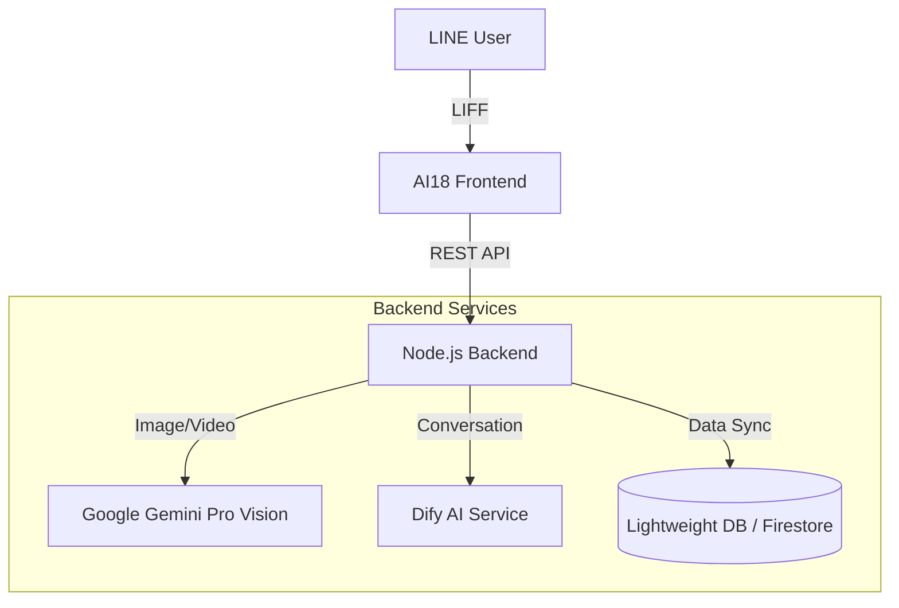

# AI18号 バックエンド設計書

## 1. 概要
本ドキュメントは、「AI18号」のバックエンド実装指針をまとめたものである。
初期段階として「60点版（安定稼働優先）」の実装を目指すが、アーキテクチャは「800点版（拡張前提）」を見据えたものとする。

---

## 2. プロダクト思想（Core Philosophy）

*   **Role**: 分析AIではなく、ユーザーの「伴走者」
*   **Focus**: 成果ではなく「行動」を評価・記憶する
*   **Mission**: ユーザーのモチベーションを上げ続けること

---

## 3. 全体アーキテクチャ



---

## 4. 機能要件（60点版 vs 800点版）

| 機能 | 60点版（初期実装） | 800点版（将来像） |
| :--- | :--- | :--- |
| **動画解析** | 格闘技フォーム（30秒以内）<br>1日1回制限<br>改善点コメントのみ | フォーム改善＋ポジティブ評価<br>成長ログの蓄積<br>過去比較による称賛 |
| **画像解析** | 食事（カロリー推定）<br>格闘技カード（解説）<br>1日3回制限 | 自動分類（食事/カード/その他）<br>詳細栄養素<br>選手名鑑との連携 |
| **人生相談** | Difyへそのまま転送<br>中継のみ | 文脈＋メモリ（過去の行動）を付与<br>人格に基づいた深い共感 |
| **メモリ** | 最終行動日時<br>継続回数（単純カウント） | セッション/プロフィール/成長の3層管理<br>ネガティブ排除・ポジティブ蓄積 |

---

## 5. APIエンドポイント設計

### 5.1 解析系
*   `POST /api/analyze/video`
    *   **Input**: Video File (via R2/S3 URL)
    *   **Output**: フォーム改善アドバイス
    *   **Rate Limit**: 1 request / day / user

*   `POST /api/analyze/image`
    *   **Input**: Image File
    *   **Output**: (食事)カロリー推定 OR (カード)解説
    *   **Rate Limit**: 3 requests / day / user

### 5.2 会話系
*   `POST /api/chat`
    *   **Input**: User Message, User ID
    *   **Process**:
        1. ユーザーメモリ取得（努力回数、目標など）
        2. Dify APIへコンテキスト付きで送信
        3. Difyからの返答を整形して返却

### 5.3 ユーザーデータ系
*   `GET /api/user/status`
    *   **Output**: 本日の残り回数、現在の努力カウント

---

## 6. データモデル（Schema）

初期はNoSQLまたはJSONベースの軽量設計とする。

### User Document
```json
{
  "userId": "line_123456789",
  "profile": {
    "goal": "ダイエット",
    "level": "beginner"
  },
  "usage": {
    "todayVideoCount": 0,
    "todayImageCount": 1,
    "lastAccessDate": "2025-12-17"
  },
  "memory": {
    "effortCount": 15,
    "lastActionType": "video_upload",
    "lastPositiveAction": "2025-12-16T10:00:00Z"
  }
}
```

**更新ルール**:
*   動画・画像アップロード時 -> `effortCount` + 1
*   相談時 -> `effortCount` + 1（前向きなアクションとしてカウント）
*   ネガティブな発言や失敗ログは**保存しない**

---

## 7. 実装ガイドライン

### 安定化ルール（Must）
1.  **全API try/catch**: 予期せぬエラーでもサーバーを落とさない。
2.  **フォールバック**: AI解析失敗時は「ごめん、ちょっと今目が疲れちゃって…もう一回見せてくれる？」等の固定メッセージを返す（システムエラー画面を見せない）。
3.  **キャッシュ**: 短時間での同一リクエストはキャッシュを返し、APIコストを削減。

### 禁止事項
1.  **説教・比較**: 「前より悪くなってる」等の比較はNG。「続けててえらい」を最優先。
2.  **長期ログ保存**: プライバシー保護と軽量化のため、必要最小限のメモリのみ保持。
3.  **ユーザー比較**: 「他の人はもっとできてる」等の発言禁止。

---

## 8. 次のアクション（Implementation Steps）

1.  **[Task 1]** バックエンドAPIのモック作成（Video/Image/Chat）
2.  **[Task 2]** DB選定と接続（Firebase Firestore 推奨）
3.  **[Task 3]** 画像・動画解析ロジックの実装（Gemini Pro Vision連携）
4.  **[Task 4]** Dify連携の実装

